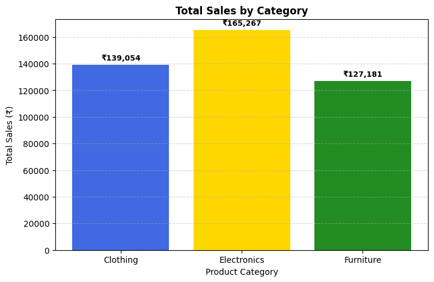
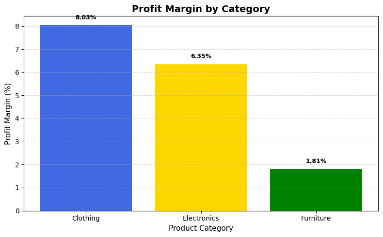
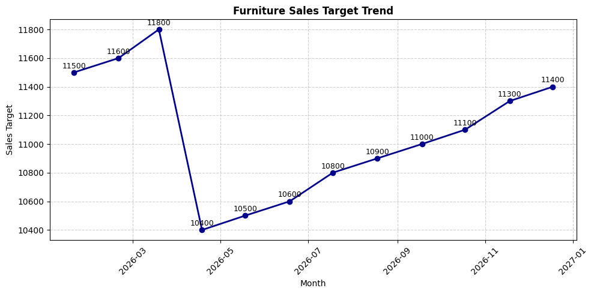
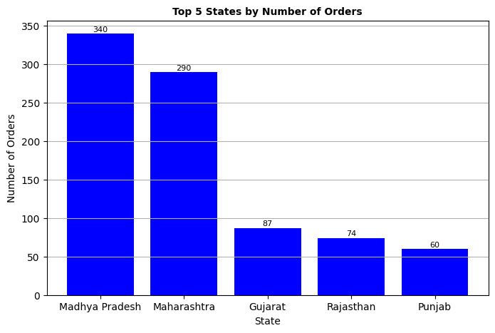
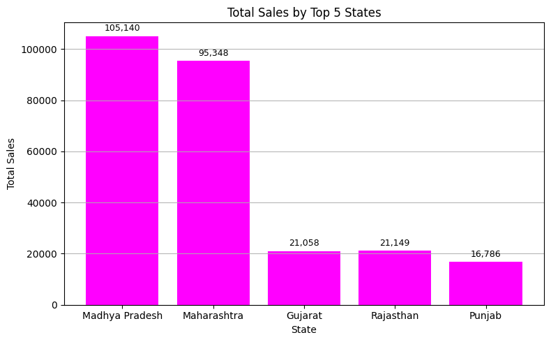
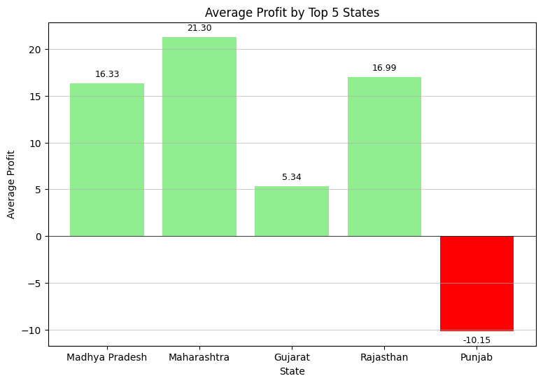

# Sales Growth and Business Performance Analysis

A sales and business performance analysis project built on order-level retail data. The project examines category-wise profitability, monthly sales target trends, and regional performance across states, using Python for data cleaning, aggregation, and visualization.

## Overview

The analysis works with three linked datasets — order records, order-level details (category, amount, profit), and monthly sales targets — to answer three business questions:

1. **Sales & Profitability Analysis** — which product categories drive the most revenue, and which are the most profitable?
2. **Target Achievement Analysis** — how did the Furniture category's sales targets fluctuate month over month, and what does that reveal about planning?
3. **Regional Performance Insights** — which states generate the most orders and profit, and which regions need attention?

## Data

| File | Description |
|---|---|
| `List_of_Orders.xlsx` | Order-level records: Order ID, customer, state, order date |
| `Order_Details.xlsx` | Category, amount, and profit for each order |
| `Sales_target.xlsx` | Monthly sales targets by category |

> Data files are not included in this repository. Place them in the project root before running the notebook.

## Key Findings

### 1. Sales & Profitability by Category

Electronics generated the highest total sales and the highest average profit per order, but Clothing had the strongest profit margin — meaning it converts revenue into profit most efficiently. Furniture lagged on both average profit and profit margin.

<p align="center">
  
  
</p>

| Category | Insight |
|---|---|
| Clothing | Highest profit margin (8.03%) with steady sales — the most efficient category overall |
| Electronics | Highest total sales (₹165,267) and highest average profit per order (₹34.07), but a lower margin (6.35%), pointing to higher costs or tighter pricing |
| Furniture | Lowest profit margin (1.81%) and lowest average profit (₹9.46) despite decent sales — likely higher production, discount, or shipping costs |

### 2. Furniture Sales Target Trend

Monthly targets for Furniture were sorted and analyzed for month-over-month percentage change.

<p align="center">
  
</p>

- Jan–Mar targets were high, followed by a sharp correction — suggesting early-year demand was overestimated
- The Apr–May dip points to inconsistent planning following that overestimation
- Targets became steadier after April, suggesting a shift toward more data-driven, sustainable planning

**Suggested strategies:** set targets from historical performance rather than fixed annual assumptions, avoid overestimation, update targets monthly using real-time data, and adjust for expected demand cycles.

### 3. Regional Performance

The top 5 states by order count were analyzed for total sales and average profit per order.

<p align="center">
  
  
</p>
<p align="center">
  
</p>

| State | Observation |
|---|---|
| Madhya Pradesh | Highest order count (340) and highest total sales (₹101,540) — strong demand and customer base |
| Maharashtra | Fewer orders (290) than Madhya Pradesh but the highest average profit per order (₹21.30) — best pricing efficiency |
| Rajasthan | Moderate sales with a healthy average profit (₹16.99) — stable performance |
| Gujarat | Low sales (₹21,058) and low average profit (₹5.34) — room to improve on both fronts |
| Punjab | Lowest sales and the only **negative** average profit (-₹10.15) — operating at a loss |

**Priority for improvement:** Punjab first (losses need investigation into pricing, discounting, and logistics costs), then Gujarat (low sales and profit call for marketing and promotion), while Madhya Pradesh should be maintained and optimized for efficiency rather than growth.

## Tools & Libraries

- Python
- pandas, numpy
- matplotlib, seaborn
- Jupyter / Google Colab

## Project Structure

```
├── Growth_Data_Analysis.ipynb   # Full analysis notebook
├── images/                      # Exported charts referenced in this README
└── README.md
```

## How to Run

1. Clone the repository
   ```
   git clone https://github.com/kulsum82/growth-data-analysis.git
   cd growth-data-analysis
   ```
2. Install dependencies
   ```
   pip install pandas numpy matplotlib seaborn openpyxl
   ```
3. Place `List_of_Orders.xlsx`, `Order_Details.xlsx`, and `Sales_target.xlsx` in the project root
4. Open `Growth_Data_Analysis.ipynb` in Jupyter or Google Colab and run all cells

## Author

**Umme Kulsum** — B.S. Statistics student | [GitHub](https://github.com/kulsum82)
